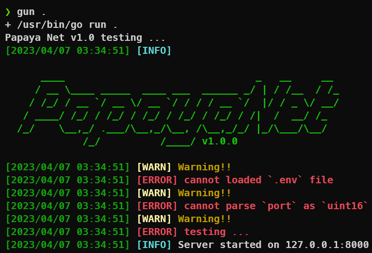

# PpNet (PapayaNet)

PpNet (PapayaNet) is a web framework for API server, built-in from library Fiber, GORM, Etc.
Make it easy use for development, debugging and testing ...

## Features

- Swagger, Validator
- Collection, Mapping, Iterator
- Console, Colorful

## Built With

- Fiber, FastHTTP
- GORM, PostgreSQL, MySQL, SQlite

## Getting Started

### Prerequisites

### Installation

### Usage

## Roadmap

## Contributing

## License

Distributed under the BSD 3-Clause License. See `LICENSE` for more information.

## Contact

[author]()